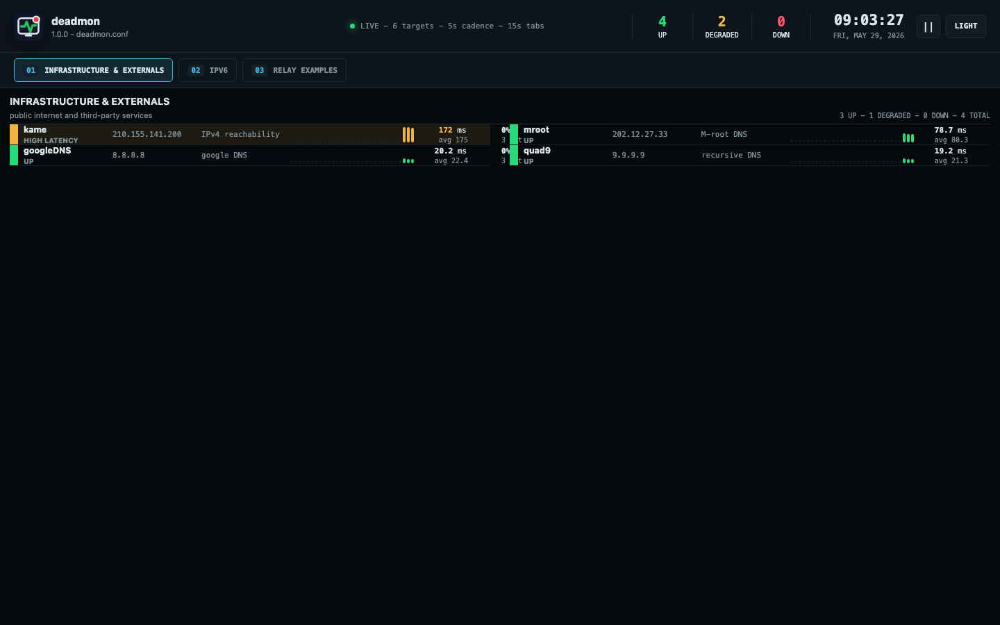

# deadmon

Web-native reachability monitor for direct ICMP, SSH relay, SNMP ping,
Linux netns/VRF, RouterOS REST API ping, and TCP reachability checks.



## Documentation

- [Deployment guide](docs/deployment.md)
- [Usage guide](docs/usage.md)
- [Configuration reference](docs/configuration.md)

## Install

Install from PyPI:

```sh
pip install deadmon
```

Run using the Docker Hub image:

```sh
docker run --rm -p 8000:8000 xorrkaz/deadmon
```

## Run locally

```sh
uv sync
just run
```

Open `http://127.0.0.1:8000`.

Common commands:

```sh
just check
just lint
just format
just dump-config
just convert-config deadmon.conf
just run 0.0.0.0 8000 deadmon.conf
```

## Configuration

`deadmon.conf` is YAML by default, and JSON is also accepted. Slack and Webex
alerts are configured as webhook channels:

```yaml
app:
  latency_warning_ms: 100
  latency_critical_ms: 250

alerts:
  enabled: true
  threshold: 3
  clear_threshold: 2
  channels:
    - name: slack-noc
      type: slack
      enabled: true
      webhook_url_env: SLACK_WEBHOOK_URL
      channel: "#noc-alerts"
      icon_emoji: ":scream:"
    - name: webex-noc
      type: webex
      enabled: true
      webhook_url_env: WEBEX_WEBHOOK_URL
```

An active alert fires after `threshold` consecutive failures. A cleared alert
fires after `clear_threshold` consecutive successes. Groups can override alert
thresholds and channels, and individual targets can suppress inherited alert
delivery with `alerts: false`.

See the [configuration reference](docs/configuration.md) for probe examples and
field details.

## Docker

```sh
just docker-up
```

The compose file grants `NET_RAW` so ICMP works in the container and uses an
IPv6-enabled bridge network so IPv6 probe targets can work from Docker. netns
and VRF probes may require additional host-specific privileges and mounts.

See the [deployment guide](docs/deployment.md) for Docker, reverse proxy, and
production notes.

## License

Deadmon is licensed under the MIT License, preserving the original deadman
copyright notice and licensing the deadmon changes under the same terms. See
[LICENSE](LICENSE).

## Attribution

Deadmon is based on the original terminal-oriented [deadman](https://github.com/upa/deadman).
Deadman was copyright to the Interop Tokyo ShowNet
NOC team, and itself was based on the original software `pingman`. Deadman was
originally written by `upa@haeena.net`.
Deadmon keeps that lineage visible while moving the tool
to a web-native monitor and alerting workflow.
